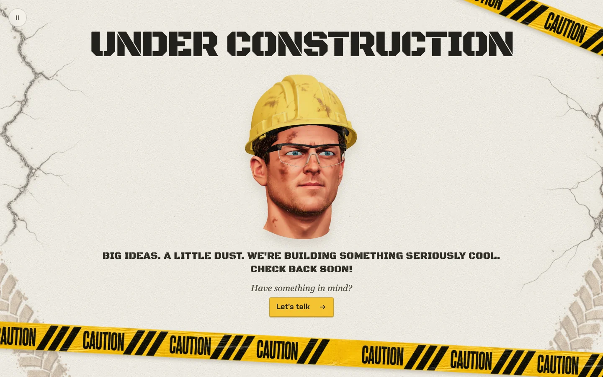
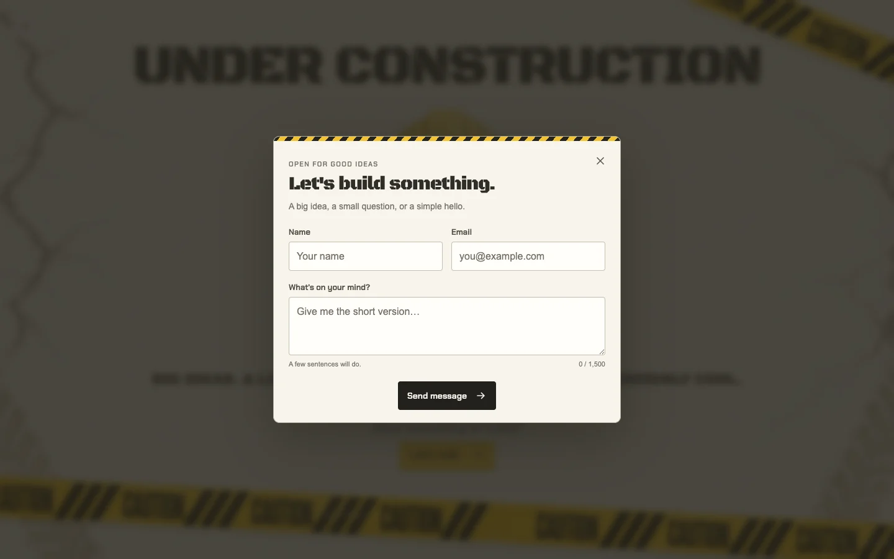

> Detailed product guide. For current installation, source availability, licensing and demo links, start with the [repository README](../README.md).

# Interactive Under Construction

**An animated 3D coming-soon page you can ship in an afternoon.**

A weathered-jobsite placeholder built around a real-time 3D character who
watches your visitor's cursor and looks around the page on their own when left
alone. Everything you would normally want to change lives in one configuration
file.

Version **1.0.0** · Created by **Jimmy Hickman** · Published by **Falcon Forged Ventures LLC**

---

## Screenshots

| | |
| --- | --- |
|  |  |
| Desktop, 1440 × 900 | Phone, 390 × 844 |


*The optional contact dialog, with inline validation and an optional captcha slot.*

---

## What you get

- **A real-time 3D avatar.** Not a video, not a GIF — a glTF model rendered with
  WebGL. It tracks a mouse or pen cursor, and after a few seconds of stillness
  eases into an autonomous performance: sixteen distinct page-directed looks,
  surveys, nods and tilts, reshuffled every cycle so it never loops visibly.
- **Graceful degradation, all the way down.** No WebGL, a failed model download,
  a lost GPU context, Save-Data mode, or `prefers-reduced-motion` — every one of
  those paths lands on a crisp static portrait, and the page is complete without
  the 3D layer.
- **A visitor-facing pause control** that remembers the choice.
- **A layered jobsite scene**: repeating concrete, edge crack decals, tyre
  treads and hazard tape, each independently switchable and served as
  AVIF with WebP fallbacks at the right density for the screen.
- **One configuration file.** `src/config/site.ts` drives copy, colours, fonts,
  the background layers, the avatar transform, lighting, animation, the contact
  form, social links, SEO, Open Graph and favicons.
- **Config validation at build time.** A bad colour or a broken model path fails
  the build with a message that tells you which field and how to fix it.
- **Four contact options**, none of them tied to us: off, `mailto:`, Formspree,
  or your own endpoint. Optional Cloudflare Turnstile.
- **An optional launch countdown** driven by a single ISO date.
- **Static, crawlable HTML.** Copy and metadata are rendered into the document
  at build time, not injected by JavaScript. The page reads correctly with
  JavaScript disabled.
- **No tracking.** Zero analytics, zero third-party requests out of the box.
  Fonts, images and the model are all served from your own origin.
- **Tests included.** 29 unit tests covering the animation controller and the
  configuration layer.

---

## Technology

| | |
| --- | --- |
| Build | [Vite](https://vite.dev) 8 |
| Language | TypeScript 5.9 (strict) |
| 3D | [three.js](https://threejs.org) r183 — WebGL, glTF + Meshopt |
| Framework | **None.** No React, Vue or Svelte. Plain modules and CSS. |
| Styling | Hand-written CSS driven by custom properties |
| Tests | `node --test` (no test framework to install) |
| Lint | [oxlint](https://oxc.rs) |
| Output | Fully static — `index.html`, CSS, JS and assets |

Because the output is static, it deploys to essentially anything.

---

## Prerequisites

- **Node.js 22.18 or newer** — [nodejs.org](https://nodejs.org). Check with
  `node --version`.
- **npm** (ships with Node).
- A code editor. Any will do; VS Code gets full type hints in the config file.
- A browser with WebGL 2 for the 3D layer. Everything else works without it.

No account, API key, database or paid service is required to run this template.

---

## Quick start

```bash
npm ci
npm run dev
```

Open the URL it prints — <http://127.0.0.1:5173> by default. Then open
`src/config/site.ts` and start editing; the page reloads as you save.

When you are ready to ship:

```bash
npm run build
```

The finished site is in `dist/`. Preview exactly what will be deployed with
`npm run preview`.

Full walkthrough: **[docs/GETTING_STARTED.md](../docs/GETTING_STARTED.md)**.

### All commands

| Command | What it does |
| --- | --- |
| `npm run dev` | Development server with hot reload |
| `npm run build` | Type-check, then build to `dist/` |
| `npm run preview` | Serve the built `dist/` locally |
| `npm test` | Run the unit tests |
| `npm run lint` | Lint the source |
| `npm run typecheck` | Type-check without building |
| `npm run check` | Lint + type-check + test + build, in one go |

---

## Project structure

```
.
├── index.html               Page shell. Placeholders are filled from config at build time.
├── vite.config.ts           Build config + the plugin that renders index.html
├── package.json
├── src/
│   ├── config/
│   │   ├── site.ts          ← THE FILE YOU EDIT
│   │   ├── types.ts         Field-by-field type definitions and inline docs
│   │   ├── theme.ts         Config → CSS custom properties and <head> tags
│   │   ├── markup.ts        Config → static HTML fragments
│   │   └── validate.ts      Build-time config checks
│   ├── main.ts              Entry point
│   ├── style.css            Layout and structure (colours come from config)
│   ├── avatar.ts            The three.js layer (lazily loaded)
│   ├── avatar-performance.ts  Gaze and idle choreography
│   ├── contact-form.ts      Dialog behaviour, validation, focus management
│   ├── contact-integration.ts Delivery backends
│   └── countdown.ts         Optional launch countdown
├── public/                  Served as-is at the site root
│   ├── avatar/              The 3D model and its static fallback
│   ├── fonts/               Self-hosted fonts + their OFL licences
│   ├── images/wallpaper/    Background layers (AVIF + WebP)
│   └── icons/, favicon.*    Icons
├── tests/                   Unit tests
└── docs/                    The guides listed below
```

---

## Customizing

**Almost everything is in [`src/config/site.ts`](../src/config/site.ts).** Open it;
every field is commented, and your editor will autocomplete the valid values.

| You want to change | Where |
| --- | --- |
| Headline, subheadline, status text | `content` |
| Colours | `theme.colors` |
| Fonts | `theme.fonts` |
| Background layers, or turn them off | `background` |
| The 3D model, its scale / position / rotation | `avatar` |
| Lighting | `lighting` |
| Animation liveliness and speed | `animation` |
| Contact form behaviour | `contact` |
| Social links | `social` |
| Launch date and countdown | `launch` |
| Title, description, Open Graph, robots | `seo` |
| Favicons | `favicon` |

Detailed guide with worked examples: **[docs/CUSTOMIZATION.md](../docs/CUSTOMIZATION.md)**.

---

## Deployment

The build output is a static folder. Configuration for the two most common
hosts is already included — `vercel.json` and `netlify.toml`.

- **Vercel** — import the project; the settings are detected. Zero config.
- **Netlify** — connect the repository; `netlify.toml` supplies the rest.
- **Cloudflare Pages, GitHub Pages, S3 + CloudFront, nginx, Apache** — upload
  `dist/`.

Step-by-step for each, including caching headers and custom domains:
**[docs/DEPLOYMENT.md](../docs/DEPLOYMENT.md)**.

---

## Browser support

Verified during release testing on **Chromium 141** (desktop and emulated
mobile viewports), which is the engine behind Chrome, Edge, Brave, Arc and
Opera.

Safari and Firefox are **expected** to work — every API used is supported in
current versions of both — but were **not** exercised in this release, so no
claim is made. `CHANGELOG.md` records exactly what was tested.

The static fallback path has no unusual requirements and works far more widely
than the 3D layer.

---

## Licensing

**Commercial end use is permitted. Redistribution or resale of the template or
its source code is prohibited.**

You may use this for personal and commercial projects, modify it however you
like, deploy it anywhere, build sites for clients with it, and charge for that
work. You may not resell, redistribute, publish or repackage the template
itself — and restyling it does not change that.

- Plain English: **[LICENSE-SUMMARY.md](../LICENSE-SUMMARY.md)**
- The agreement: **[LICENSE.md](../LICENSE.md)** — Falcon Forged Digital Product License v1.0
- Bundled third-party components: **[THIRD_PARTY_LICENSES.md](../THIRD_PARTY_LICENSES.md)**

Copyright © 2026 Falcon Forged Ventures LLC. All rights reserved.
**Licensed, not sold.**

---

## Support

Installation problems, confirmed template bugs and documentation questions are
covered. Building your site for you is not. See **[SUPPORT.md](../SUPPORT.md)** for
what is included, what is not, and how to reach us.

Something not working? Start with
**[docs/TROUBLESHOOTING.md](../docs/TROUBLESHOOTING.md)** — it covers the common
cases, including a blank avatar area.

---

## Version

**1.0.0** — see [CHANGELOG.md](../CHANGELOG.md).
